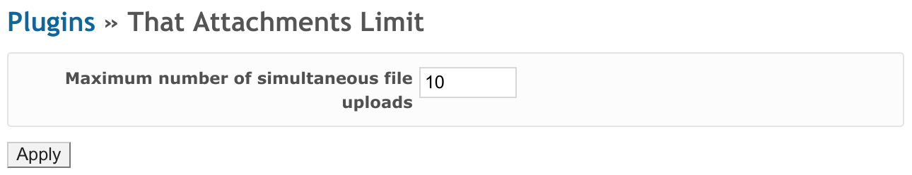

# That Attachments Limit Plugin

Pure Redmine allows maximum 10 files to be uploaded at once.
This is a well-known limitation (see [#18556](https://www.redmine.org/issues/18556)).

That Attachments Limit plugin makes this limit configurable
(**Administration** - **Plugins** - That Attachments Limit - **Configure**):

## Installation

- Move `that_attachments_limit` directory to the `plugins` directory of Redmine
- Restart Redmine

## License

GNU General Public License (GPL) v2.0
